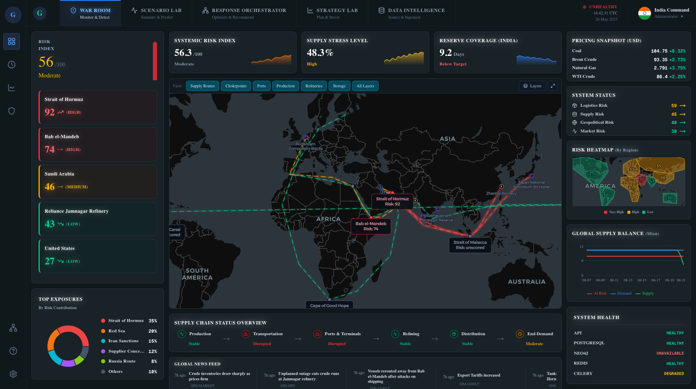
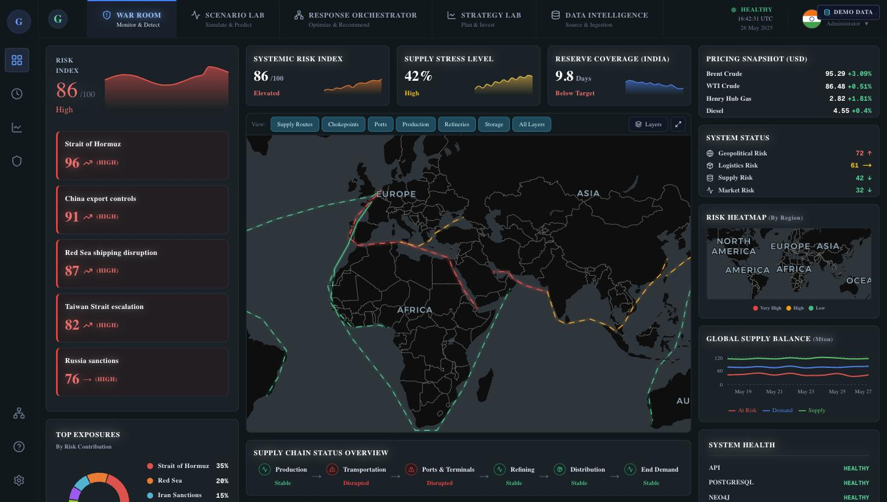
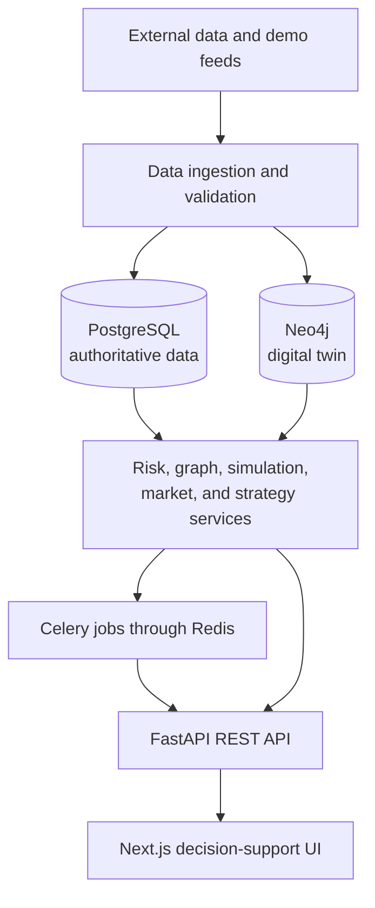
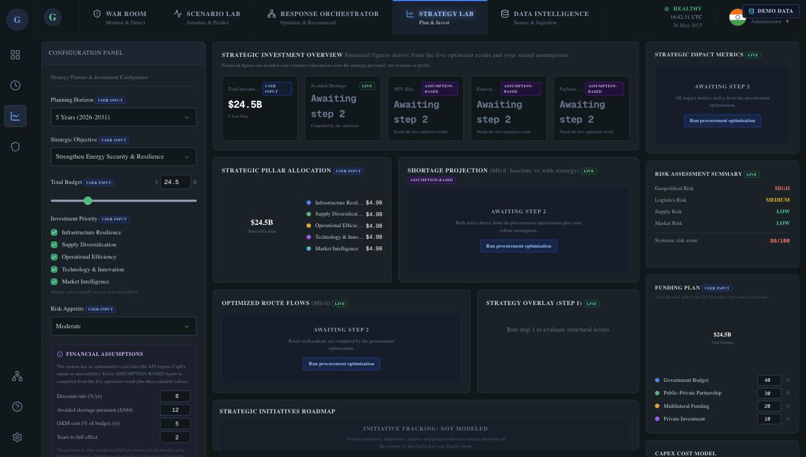
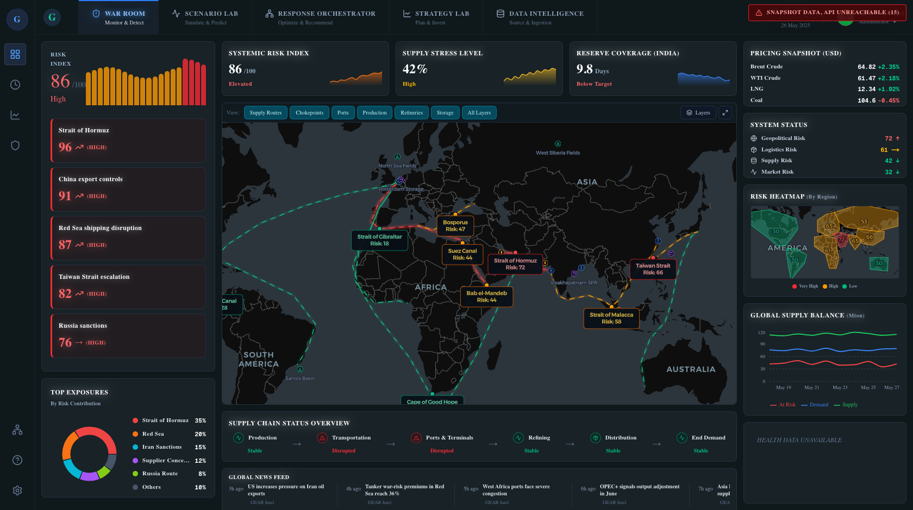
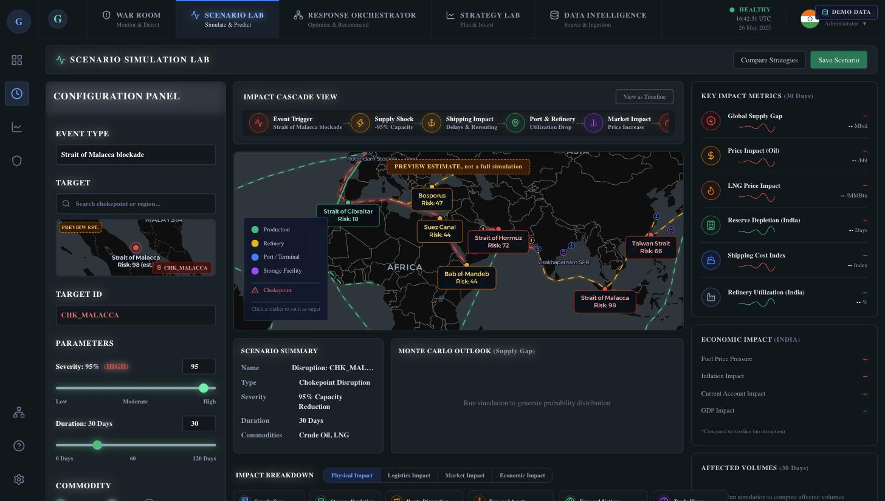
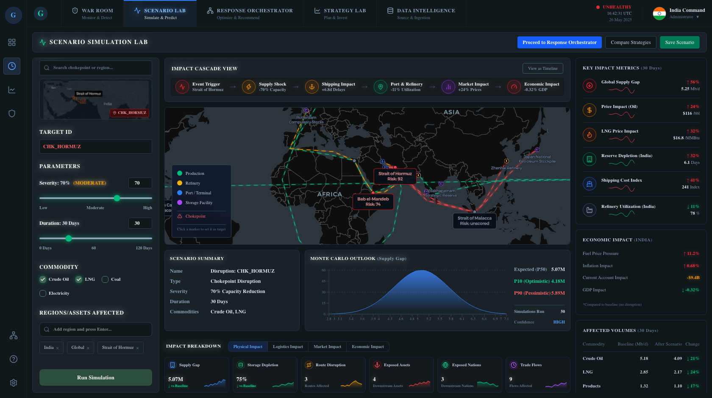

# GEAR: Global Energy Adaptive Resilience

GEAR is an AI-powered energy-supply-chain resilience and decision-intelligence platform. It creates a living digital twin of the energy network so that operators can monitor disruptions, understand their downstream impact, simulate possible futures, and compare response strategies before making time-critical decisions.

The current implementation combines a **Next.js web application**, a **FastAPI backend**, **PostgreSQL as the authoritative database**, **Neo4j as the graph-based digital twin**, **Redis and Celery for asynchronous jobs**, and Python-based graph, simulation, risk, and optimization services.



## Project Overview

India can be viewed as a large industrial system that depends on a continuous flow of crude oil. According to the project problem statement, approximately **88% of India's oil is imported**, nearly half of those imports travel through the **Strait of Hormuz**, and the country maintains roughly **9.5 days of emergency oil coverage** in underground reserves.

These figures describe the project's motivating scenario rather than measurements generated by the application. They illustrate why a disruption caused by conflict, piracy, a blocked maritime corridor, sanctions, extreme weather, or port failure could quickly affect refineries, transportation, food distribution, electricity prices, and industrial activity.

The motivating scenario is not hypothetical. At the time of writing, in the real world:

- The Strait of Hormuz is running about **10 vessels a day** against a normal baseline of 88 to 130.
- About **20% of the world's oil** and **20% of its LNG** move through that one strait.
- The Red Sea route is operating at **49% of pre-crisis capacity**.
- The IEA calls the current situation **the largest supply disruption in the history of the oil market**.
- Global observed oil inventories fell **69 million barrels in July** alone.

(Sources: IEA Oil Market Report, US EIA.)

GEAR is designed to help answer four operational questions:

1. **What is happening?** Detect unusual vessel movement, geopolitical events, route risk, port congestion, and market changes.
2. **What could happen next?** Simulate disruption scenarios and calculate the cascade through routes, chokepoints, suppliers, assets, and downstream demand.
3. **What alternatives are actually feasible?** Match replacement crude to refinery requirements and filter options by legal, logistical, technical, and commercial constraints.
4. **What should decision-makers do now?** Compare procurement, rerouting, reserve-use, and response strategies with explanations, uncertainty, and fallback plans.

The platform is a decision-support system. It does not independently control vessels, refinery equipment, reserve valves, or financial transactions. Operational actions remain subject to authorized human approval.

## Live Demo

**https://gear-global-energy-adaptive-resilie.vercel.app**

The deployed link runs on an **embedded snapshot dataset** and displays a visible **DEMO DATA** marker in the header. It is a static build for convenient review; it does not serve live data. The full live stack (PostgreSQL, Neo4j, Redis, Celery, FastAPI) runs locally, see [Local Development](#local-development).



## The Problem GEAR Addresses

Energy disruptions are difficult to manage because several constraints interact at the same time.

| Challenge | Why it matters | GEAR response |
|---|---|---|
| Slow or incomplete information | News, tracking feeds, and port updates may arrive late or conflict with one another. | Ingest, normalize, timestamp, validate, and score data reliability. |
| Crude is not interchangeable | A refinery may not be able to process an alternative crude without blending, testing, or operational changes. | Match crude properties with refinery and storage constraints before ranking suppliers. |
| Maritime bottlenecks | Closing one corridor can add weeks of travel and overload alternative ports. | Model route time, vessel capability, fuel, port capacity, congestion, and backup options. |
| Limited emergency reserves | Reserve stocks must cover demand while replacement cargo is still in transit. | Project reserve coverage and calculate controlled withdrawal plans. |
| Rapid market reactions | Emergency buying can increase prices, freight costs, and insurance premiums. | Compare landed-cost ranges and model procurement under price competition. |

## Implemented Architecture



PostgreSQL remains the source of truth. Neo4j carries the relationship structure that makes cascade analysis possible: which routes pass through which chokepoints, and which countries depend on which suppliers. Long-running simulations go through the Celery queue; short previews are computed synchronously for responsive UI.

### Technology Stack

| Layer | Technology | Role in the system |
|---|---|---|
| Frontend | Next.js 16, React 19, TypeScript, Tailwind CSS | Provides the operator-facing dashboard and scenario workflows. |
| Mapping and visualization | MapLibre GL (keyless CARTO basemap), Recharts, Lucide React | Displays routes, chokepoints, risk overlays, trends, and system status. No API keys required. |
| API | FastAPI, Pydantic, Uvicorn | Exposes versioned REST endpoints and validates request and response data. |
| Persistence | PostgreSQL with SQLAlchemy and Alembic | Stores authoritative domain data, scenarios, jobs, risks, decisions, and audit records. |
| Digital twin | Neo4j | Represents relationships between routes, chokepoints, suppliers, assets, and dependencies. 60 nodes in the current dataset. |
| Queue and cache | Redis, Celery | Runs long-running scenario and projection jobs asynchronously, with an explicitly labeled synchronous fallback. |
| Graph analysis | NetworkX and Neo4j queries | Calculates criticality, dependencies, blast radius, exposure, and systemic risk. |
| Simulation | Python cascade engine and Monte Carlo runner | Estimates disruption propagation, impact, uncertainty, and scenario outcomes. |
| Optimization | Google OR-Tools and procurement services | Compares feasible procurement and response options under constraints. |
| Risk modelling | Deterministic risk services with scikit-learn/XGBoost dependencies | Supports risk scoring; model-based enhancements are on the roadmap. |

## Repository Structure

```text
.
├── apps/
│   ├── api/                  FastAPI backend, models, routes, services, workers, and tests
│   └── web/                  Next.js frontend and visualization components
├── db/
│   └── seeds/                Demo dataset and market reference data
├── graph/                    Neo4j client, loader, queries, and graph algorithms
├── ml/risk/                  Risk calculation and scoring logic
├── optimization/             Procurement and response optimization
├── simulation/
│   ├── cascade/              Supply-chain cascade and geographic-impact simulation
│   └── monte_carlo/          Probabilistic scenario runner
├── infra/compose/            PostgreSQL, Neo4j, and Redis Docker Compose setup
├── scripts/                  Local helper scripts
├── docs/                     Local-running docs, integration reports, and screenshots
└── *ARCHITECTURE.md          Detailed architecture and design documents
```

## Every Number Is Honest

The strongest property of the interface: **every figure on screen traces to a real computation, a live data source, or a stated assumption the user can edit. Where there is no data, the interface says so instead of guessing.**

- **Four visually distinct data states.** Live data, awaiting a run, data unavailable (carrying the backend's own reason), and not modeled. Red is reserved for genuine failures only, so a red banner always means something is actually wrong.
- **Financial figures are derived, not decorated.** NPV, ROI, and payback are computed from a visible, editable assumptions block (discount rate, avoided-shortage premium, O&M cost, ramp-up time). Change an assumption and the number moves on screen. Nothing is hardcoded.
- **Limits are stated in the product rather than hidden.** Two examples visible in the UI itself: the optimizer does not close the supply gap to zero (China's supply rides a degraded route and holds no strategic storage in the dataset), and asset-type scenario targets return an empty cascade by model design.

Every panel in the Strategy Lab carries a provenance badge: LIVE for backend-computed values, USER INPUT for operator choices, ASSUMPTION-BASED for figures derived from the editable assumptions, and NOT MODELED where the system has no data source and refuses to invent one.



When the backend is unreachable, the header switches to an explicit red failure banner and the affected panels state the reason instead of showing stale numbers:



## Core Capabilities

### 1. Energy Digital Twin

The digital twin models the connected energy network as entities and relationships. PostgreSQL remains the source of truth, while Neo4j provides relationship traversal and graph analysis.

The domain model includes countries, commodities, suppliers, routes, chokepoints, energy assets, trade flows, geopolitical events, market prices, risk scores, scenarios, asynchronous jobs, users, and decision-audit records. The current dataset holds **13 energy assets, 6 chokepoints, 7 routes (each with real coordinate paths), and 13 trade flows**, projected into a **60-node Neo4j graph**.

The graph projection supports route-to-chokepoint relationships, including routes that pass through more than one chokepoint. This allows a disruption at a secondary chokepoint to reach all dependent routes instead of reporting an incomplete impact. The `/graph/critical-nodes` endpoint ranks `CHK_HORMUZ` as the most critical node, with **7.5 Mb/d of exposed volume and 9 dependent entities**.

### 2. Risk Monitoring and Intelligence

The backend includes services for risk scoring, event classification, market ingestion, geographic risk, supply-chain status, intelligence events, and explainability. Risk categories:

- **Geopolitical risk**
- **Logistics risk**
- **Supply risk**
- **Market risk**

The API exposes heatmaps, trends, entity risk, risk categories, exposures, events, critical nodes, systemic risk, temporal exposure, and dependency relationships. Current live values: `CHK_HORMUZ` scores **91.8 (CRITICAL)** and `CHK_BAB_EL_MANDEB` **73.9 (HIGH)**; the regional heatmap puts the Middle East at **70.4** with a peak of **91.8**. The supply-chain status endpoint reports overall **DISRUPTED**: 7.8 of 10.25 Mb/d at risk (**76.1%**), with 3 routes disrupted, 1 stressed, and 3 nominal.

### 3. Scenario Simulation

GEAR supports both quick previews and asynchronous scenario runs.

The preview path serves responsive UI interactions such as moving a severity slider. It responds in **6 to 9.5 ms** and is explicitly labeled as an estimate, not a full simulation: Malacca at severity 0.3 previews at **36.0 (stable)**, at 0.9 it previews at **78.0 (disrupted)**.



Full scenario execution goes through Celery. Results include impacted routes, impacted chokepoints, status overlays, economic impact, and explanation data. A real queued run against Malacca at severity 0.9 produced a supply gap of **4.68 Mb/d against a 5.2 Mb/d baseline**, a Monte Carlo **P10/P50/P90 band of 3.94 / 4.56 / 5.12**, impacts on routes `RT_HORMUZ_CHINA` and `RT_HORMUZ_JAPAN`, affected countries Japan and China, 4 affected suppliers, and an economic impact score of 12.86.



The implementation uses the following status vocabulary:

| Status | Meaning |
|---|---|
| `stable` | The calculated impact remains below the at-risk threshold. |
| `at_risk` | The entity is exposed and requires monitoring or mitigation. |
| `disrupted` | The calculated impact has crossed the disruption threshold. |

The scenario engine combines baseline risk with scenario severity and propagates impact through linked routes and chokepoints. The Monte Carlo runner repeats a scenario across multiple iterations to estimate the range of possible outcomes, which is why results ship as P10/P50/P90 bands rather than a single false-precision number.

### 4. Crude Compatibility and Procurement Planning

The procurement layer compares alternative supply options rather than treating every crude shipment as interchangeable. Crude properties (API gravity, sulfur, viscosity, acidity, contaminants) interact with refinery configuration, blending rules, tank capacity, supplier availability, shipping cost, insurance, and delivery time; a barrel is not just a barrel.

The procurement optimizer compares routes, reserves, destinations, and duration constraints. Applied to the Malacca run above, it reduces the supply gap from **4.68 Mb/d to 2.75 Mb/d, an improvement of 1.93 Mb/d**. It does not reach zero, and the UI says so: China's supply rides a degraded route and holds no strategic storage in the dataset, so a residual gap remains. Optimizer output is a planning recommendation that requires technical, legal, and commercial review before execution.

On top of the optimizer result, the Strategy Lab financial layer prices a response strategy from its editable assumptions. At the default **$12/bbl avoided-shortage premium**, the current plan shows an **NPV of $5.0B**, **34.2% annualised ROI**, and a **2.9-year payback**. All three figures recalculate on screen when any assumption changes.

### 5. Route and Chokepoint Analysis

The graph and simulation services support analysis of:

- Critical nodes and structural criticality.
- Upstream and downstream exposure.
- Dependency relationships.
- Blast radius for a selected entity.
- Systemic risk for an asset, route, or chokepoint.
- Time-bounded exposure and active events.
- Geographic route geometry and map overlays (all 7 routes carry real coordinate paths).
- Scenario impact across connected network entities.

### 6. Decision and Response Workflows

The API includes decision, strategy, response, optimization, scenario, market, intelligence, risk, graph, and world routes. Decision records support review, approval, rejection, and audit history so that recommendations can be traced to an authorized decision process.

The response workflow is intentionally separated into analysis and approval:

```text
Detect event
    -> Verify evidence
    -> Estimate impact
    -> Generate alternatives
    -> Compare routes and suppliers
    -> Review reserve coverage
    -> Explain recommendation
    -> Human approval
    -> Monitor execution
```

## Rerouting Decision Factors

GEAR does not choose a reroute based only on the shortest distance or the lowest quoted oil price. The route-planning decision depends on several hard constraints and competing objectives.

| Factor | Implementation consideration |
|---|---|
| Security | Conflict zones, piracy, military activity, attacks, and vessel-specific threats affect route feasibility and risk. |
| Legal and political restrictions | Sanctions, export controls, port restrictions, insurance limitations, and diplomatic constraints must be applied before ranking. |
| Vessel capability | Draft, size, fuel capacity, route restrictions, canal eligibility, and terminal compatibility limit available paths. |
| Travel time | Transit time must include weather, waiting, refueling, canal delays, and port queues. |
| Port capacity | Berths, unloading equipment, storage, bunkering, customs, labor, and pipeline access determine whether a port can accept the shipment. |
| Congestion | A route is not resilient if every diverted vessel is sent to the same overloaded port. |
| Weather and sea conditions | Storms, waves, currents, visibility, and seasonal conditions can change both safety and arrival time. |
| Crude compatibility | The cargo must be suitable for the destination refinery or have an approved blending and testing plan. |
| Supplier reliability | Availability, lead time, delivery history, and ability to supply the required volume must be evaluated. |
| Landed cost | Crude price, freight, fuel, insurance, storage, handling, blending, and delay costs are combined, not quoted price alone. |
| Reserve coverage | The plan must preserve sufficient emergency stock until replacement cargo arrives. |
| Resilience | The alternative must not create a new single point of failure at another supplier, port, corridor, or storage facility. |

A practical route score combines these objectives after hard constraints have been applied:

```text
Route score = safety
            + delivery reliability
            + supply continuity
            + port feasibility
            - travel-time penalty
            - congestion penalty
            - landed-cost penalty
            - legal and political risk penalty
```

The dashboard displays each component of the score, not only the final ranking. This makes the recommendation reviewable and allows authorized users to change priorities during a crisis. It is the same principle as the editable financial assumptions block: show the inputs, not just the answer.

## Edge Cases and Planned Handling

Naming what breaks matters as much as showing what works. Each case below states the failure mode and how GEAR handles it today or is designed to handle it. Items not yet implemented are marked as design targets and also appear in the [Roadmap](#roadmap).

### Chemical Incompatibility

A low-cost crude option may damage equipment, reduce refinery throughput, or produce an unsuitable product mix. The compatibility layer compares API gravity, sulfur, viscosity, acidity, contaminants, refinery limits, current feedstock, storage constraints, and blending requirements before an option is ranked.

Design target: classify options as compatible, compatible with blending, conditionally compatible, incompatible, or unknown, with unknown and conditional results requiring laboratory or refinery-engineering approval before procurement.

### Fake or Manipulated GPS Signals

AIS or GPS data can be spoofed, interrupted, or inconsistent with a vessel's actual location. The design rule: conflicting signals reduce confidence and trigger verification; they are never treated as proof that a vessel is safe. Cross-checks against satellite imagery, speed and heading, port records, weather, destination declarations, and historical behavior are a design target.

### Backup-Port Congestion

When a major corridor is closed, multiple ships may divert toward the same small set of ports, which just moves the bottleneck. The simulator models port capacity pressure; distributed port assignments, staggered departures, alternative destinations, temporary storage, and legally permitted ship-to-ship operations are design targets for the optimizer.

### Sudden Price Spikes

Emergency procurement can cause crude, freight, insurance, and storage prices to rise quickly. The market and procurement services present ranges and scenario assumptions instead of one false-precision estimate; the Monte Carlo P10/P50/P90 bands apply the same discipline to supply gaps. Every plan shows expected landed cost alongside the cost of waiting, drawing down reserves, using another supplier, or taking a longer route.

### Delayed or Missing Data

External feeds may be stale, unavailable, or contradictory. Every important observation carries a source, timestamp, validation state, and reliability score. When data quality is low, the simulator widens its uncertainty range, and the UI marks the value as an assumption or reports it unavailable with the backend's reason. This is the honesty system doing its job at the data layer.

### Multiple Simultaneous Disruptions

A crisis may affect a chokepoint, supplier, port, vessel, and refinery at the same time. Compound scenarios are a design target so that the system never recommends an alternative that simply transfers the bottleneck to another part of the network.

### Vessel Breakdown or Cargo Loss

If a vessel breaks down, is seized, suffers an accident, or loses cargo, a response plan needs replacement cargo, alternate unloading ports, available storage, reserve coverage, and revised arrival estimates. The response workflow's alternative-generation step is built for this; automated re-planning on vessel events is a design target.

### Sanctions and Legal Restrictions

A technically suitable crude is not necessarily legally purchasable or transportable. Supplier, cargo, vessel, flag, port, insurer, and route restrictions are hard constraints applied before ranking, never soft penalties inside the score. Uncertain legal cases escalate for human review.

### Refinery or Storage Failure

Stored volume alone is not enough; what matters is how much stock can actually reach the affected demand center. The model accounts for reserve deliverability in its coverage projections. Refinery maintenance windows, tank unavailability, pipeline outages, and terminal failures as first-class scenario inputs are a design target.

## API Surface

The backend is mounted under `/api/v1`. The principal API areas:

| Area | Representative operations |
|---|---|
| Authentication | Issue tokens and authenticate protected requests. |
| World | List assets, routes, chokepoints, supply-chain status, and balance time series. |
| Risks | Heatmaps, trends, categories, entity risk, exposures, and evaluation. |
| Intelligence | List and inspect intelligence events and data sources. |
| Graph | Critical nodes, dependencies, exposure, blast radius, systemic risk, and temporal analysis. |
| Scenarios | Create scenarios, preview severity, run jobs, retrieve results, and review scenario audits. |
| Optimization | Run procurement and response optimization workflows. |
| Decisions | List decisions, inspect audit history, and approve, reject, or review recommendations. |
| Strategy and response | Manage response strategies and orchestrated response workflows. |
| Market | Read market prices and market-related supply information. |

Interactive API documentation is available from FastAPI at `/docs` when the backend is running.

## Local Development

### Prerequisites

Install Docker with Compose support, Python 3.12, Node.js 18 or newer, and npm. Python dependencies come from `apps/api/requirements.txt` and Node dependencies from `apps/web/package.json`.

### 1. Configure the environment

Copy the example configuration into the repository root:

```bash
cp .env.example .env   # then fill in real values
```

The `.env` file is **gitignored and must never be committed**. Required variables (see `.env.example` for details and local-dev defaults): `POSTGRES_DB`, `POSTGRES_USER`, `POSTGRES_PASSWORD`, `POSTGRES_HOST`, `POSTGRES_PORT`, `NEO4J_URI`, `NEO4J_USER`, `NEO4J_PASSWORD`, `CELERY_BROKER_URL`, `CELERY_RESULT_BACKEND`, `JWT_SECRET_KEY`, and `EIA_API_KEY`. Optional: `CELERY_TASK_QUEUE`, `NEXT_PUBLIC_GEAR_DATA_MODE`.

> **Incident note:** a `.env` file containing real values for `POSTGRES_PASSWORD`, `NEO4J_PASSWORD`, `EIA_API_KEY`, and `JWT_SECRET_KEY` was previously committed to this public repository and remains in git history. Treat every one of those values as compromised: rotate the EIA API key, generate a new `JWT_SECRET_KEY`, and change any non-local database passwords. Removing the file from the current tree does not remove it from history.

The local Compose defaults use the following services:

| Service | Port | Purpose |
|---|---:|---|
| PostgreSQL | `5432` | Authoritative application database |
| Neo4j HTTP | `7474` | Neo4j browser and HTTP access |
| Neo4j Bolt | `7687` | Graph database driver connection |
| Redis | `6379` | Celery broker and cache/pub-sub support |
| FastAPI | `8000` | Backend API |
| Next.js | `3000` | Frontend development server |

Ensure that `NEO4J_PASSWORD` in `.env` matches the password used by `infra/compose/docker-compose.yml`. This is a real trap we hit: a mismatch does not crash the API, it leaves it running while every graph endpoint silently reports `data_unavailable`. If the graph panels are empty, check this first.

### 2. Start infrastructure

```bash
docker-compose -f infra/compose/docker-compose.yml up -d
```

The equivalent Compose v2 command is:

```bash
docker compose -f infra/compose/docker-compose.yml up -d
```

Check that the containers are healthy before continuing:

```bash
docker ps
```

### 3. Create a Python environment

```bash
python3.12 -m venv .venv
./.venv/bin/pip install -r apps/api/requirements.txt
```

### 4. Initialize and seed PostgreSQL

```bash
cd apps/api
../../.venv/bin/python scripts/bootstrap_db.py
cd ../..

./.venv/bin/python db/seeds/demo_dataset.py
```

Optional ingestion commands populate risk scores and market observations:

```bash
cd apps/api
../../.venv/bin/python scripts/ingest.py
../../.venv/bin/python scripts/ingest_market_prices.py
cd ../..
```

### 5. Load the Neo4j digital twin

Neo4j starts empty, so load the graph projection after PostgreSQL has been seeded. An up container with no data still means every graph endpoint returns `data_unavailable`.

```bash
./.venv/bin/python graph/loaders/digital_twin_loader.py
```

The loader rebuilds the graph projection from PostgreSQL. Do not run it while another user is relying on the live graph for a demonstration or test.

### 6. Start the API

```bash
cd apps/api
../../.venv/bin/python -m uvicorn main:app --host 127.0.0.1 --port 8000
```

The development authentication flow uses:

```text
POST /api/v1/auth/token
username=admin
password=admin123
```

Use the configured authentication and authorization settings for any non-demo environment.

### 7. Start the Celery worker

Full scenario execution requires a worker that consumes the Redis-backed queue:

```bash
cd apps/api
../../.venv/bin/python -m celery -A workers.celery_app worker --loglevel=info --concurrency=2
```

If no worker is available, scenario execution fails fast with `QUEUE_UNAVAILABLE` instead of remaining indefinitely in a queued state. The synchronous fallback exists, and when it is used the result is explicitly labeled as an inline run.

### 8. Start the web application

In a separate terminal:

```bash
cd apps/web
npm install
NEXT_PUBLIC_API_URL=http://localhost:8000/api/v1 npm run dev -- -p 3000
```

Open the frontend at [http://localhost:3000](http://localhost:3000). The API documentation is available at [http://localhost:8000/docs](http://localhost:8000/docs).

## Verification

Run the following checks after starting the stack. All of them must return real data, not `data_unavailable`:

```bash
curl -s localhost:8000/api/v1/health
curl -s localhost:8000/api/v1/world/routes                # 7 routes with path + chokepoint_ids
curl -s localhost:8000/api/v1/world/chokepoints           # 6 chokepoints with risk_score
curl -s localhost:8000/api/v1/risks/heatmap               # regions with scores
curl -s localhost:8000/api/v1/world/supply-chain-status
curl -s localhost:8000/api/v1/graph/critical-nodes        # body must contain nodes; 200 alone proves nothing
curl -s localhost:8000/api/v1/graph/dependencies/EnergyAsset/REF_JAMNAGAR
```

For a scenario smoke test:

```bash
SID=$(curl -s -X POST localhost:8000/api/v1/scenarios \
  -H 'Content-Type: application/json' \
  -d '{"name":"demo","target_id":"CHK_MALACCA","severity":0.9,"duration_days":30}' \
  | jq -r .id)

curl -s -X POST "localhost:8000/api/v1/scenarios/$SID/run"
sleep 5
curl -s "localhost:8000/api/v1/scenarios/$SID/results" \
  | jq '.results.impacted_routes, .results.impacted_chokepoints'
```

Use a target with a lower baseline risk when testing severity changes. Impact stacks on live baseline risk, so a target that is already near-critical (Hormuz at roughly 92) saturates at 100 for any severity. Malacca has a low baseline, which is why severity visibly moves its scores and flips statuses.

## Testing

The backend includes tests covering the end-to-end pipeline, decision center, economic impact, explainability, graph traversal, ingestion, optimization, projection, response orchestration, risk APIs, route geometry, scenario previews, geographic impact, strategy, and advanced simulation behavior.

Run the API tests from the repository root with the project's Python environment:

```bash
./.venv/bin/python -m pytest apps/api/tests
```

For frontend validation:

```bash
cd apps/web
npm run lint
npm run build
```

## Data and Model Governance

Because GEAR supports high-impact energy decisions, its recommendations must remain explainable and auditable. The implementation preserves source attribution, timestamps, reliability scores, assumptions, decision history, and approval status. Decision records carry a full review, approval, rejection, and audit trail.

Hard constraints override optimization scores. Refinery safety limits, legal restrictions, vessel navigability, unavailable ports, and insufficient reserve deliverability are filters, not penalties. When information conflicts or confidence is low, the system exposes the uncertainty (wider bands, explicit unavailability, labeled assumptions) rather than presenting a precise but unsupported answer.

## Roadmap

The current codebase provides the core foundation for the digital twin, API, frontend map experience, risk services, scenario simulation, graph analysis, market ingestion, procurement optimization, and response workflows. The next implementation priorities are:

1. Connect additional verified maritime, satellite, weather, port, market, and supplier data sources, including AIS cross-verification against independent signals.
2. Expand crude-quality and refinery-compatibility data so procurement recommendations can be operationally validated, with the five-class compatibility classification described in the edge cases.
3. Add multi-objective route optimization with explicit security, legal, port, vessel, reserve, and cost constraints, including compound (multi-disruption) scenarios.
4. Improve uncertainty modelling for missing data, spoofed locations, port congestion, and sudden price changes.
5. Add production-grade authentication, role-based approvals, encrypted secrets, observability, model versioning, and audit retention.
6. Validate the system against historical and synthetic disruption scenarios with domain experts.

## Related Documentation

The repository contains deeper design material for individual subsystems:

- [System architecture](ARCHITECTURE.md)
- [Backend architecture](BACKEND_ARCHITECTURE.md)
- [Database architecture](DATABASE_ARCHITECTURE.md)
- [Data model](DATA_MODEL.md)
- [Data ingestion architecture](DATA_INGESTION_ARCHITECTURE.md)
- [Digital-twin graph architecture](GRAPH_ARCHITECTURE.md)
- [Simulation architecture](SIMULATION_ARCHITECTURE.md)
- [Optimization architecture](OPTIMIZATION_ARCHITECTURE.md)
- [Frontend architecture](FRONTEND_ARCHITECTURE.md)
- [Infrastructure architecture](INFRASTRUCTURE_ARCHITECTURE.md)
- [Security architecture](SECURITY_ARCHITECTURE.md)
- [API contract](API_CONTRACT.md)
- [Running locally](docs/RUNNING_LOCALLY.md)

## Project Status

GEAR is an active prototype and demonstration platform. It contains live API paths, database-backed workflows, graph projections, scenario execution, frontend visualizations, tests, and demo-data support.

Known limits, stated plainly:

- **The dataset is curated, not exhaustive.** 13 assets, 6 chokepoints, 7 routes, 13 trade flows. Enough to model the real Hormuz and Red Sea situation, not the whole planet.
- **The optimizer cannot reach zero gap.** China's supply rides a degraded route and holds no strategic storage in the dataset, so a residual gap remains. The UI says this.
- **Asset-type scenario targets return an empty cascade** by model design; the cascade model is built around chokepoints and routes.
- **The Vercel deploy is a snapshot** with a visible DEMO DATA marker. The live stack runs locally.
- **Financial outputs depend on their stated assumptions.** The $12/bbl avoided-shortage premium is an editable default, not a market quote.

Treat GEAR as a research and decision-support system until its external data quality, operational integrations, security controls, and domain validation are completed.

## License

No license file is currently present in the repository. Add an appropriate license before distributing or deploying the project publicly.
