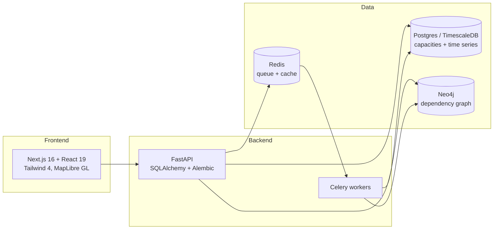

# GEAR: Global Energy Adaptive Resilience

**A live model of the world's energy supply network. It tells you what breaks next when a shipping chokepoint closes, and what to do about it.**

## Nine and a half days

Start with the problem statement that motivates GEAR:

- About **88% of India's oil is imported**.
- Nearly **half of those imports pass through the Strait of Hormuz**.
- India's strategic reserves hold roughly **9.5 days** of emergency oil coverage.

If Hormuz closes, the clock starts at nine and a half days. These figures frame the problem. They are not outputs of the system.

And the problem is not hypothetical. In the real world right now:

- Hormuz is running about **10 vessels a day** against a normal baseline of 88 to 130.
- About **20% of the world's oil** and **20% of its LNG** move through that one strait.
- The Red Sea route is at **49% of pre-crisis capacity**.
- The IEA calls this **the largest supply disruption in the history of the oil market**.
- Global observed oil inventories fell **69 million barrels in July** alone.

(Sources: IEA Oil Market Report, US EIA.)

## Four questions, three screens

A crisis desk needs answers to four questions. GEAR gives each one a screen.

One thing first: GEAR is decision support. It does not control vessels, refinery equipment, reserve valves, or money. Every action stays with an authorised human.

### 1. What is happening? (War Room)

A live world map of 13 energy assets, 6 chokepoints, 7 shipping routes, and 13 trade flows, every route with real coordinates. It watches route risk, port congestion, geopolitical events, and market prices. Right now it shows Hormuz at risk **91.8 (CRITICAL)** and Bab el-Mandeb at **73.9 (HIGH)**. Supply chain status: **DISRUPTED**, with 7.8 of 10.25 million barrels per day at risk (76.1%), 3 routes disrupted, 1 stressed, 3 nominal.


### 2. What could happen next? (Scenario Lab)

Pick a chokepoint, set a severity, and trace the cascade through routes, suppliers, assets, and downstream demand. A preview responds in **6 to 9.5 ms**: Malacca at severity 0.3 scores 36.0 (stable), at 0.9 it scores 78.0 (disrupted). A full run adds a Monte Carlo simulation over the dependency graph. A real Malacca run at severity 0.9 produced a supply gap of **4.68 out of a 5.2 Mb/d baseline**, with a P10/P50/P90 band of **3.94 / 4.56 / 5.12**, hitting the Hormuz-China and Hormuz-Japan routes, Japan and China as countries, and 4 suppliers.


### 3 and 4. What alternatives are possible, and what should we do now? (Strategy Lab)

Alternatives are harder than they look, because **crude is not interchangeable**. A refinery often cannot simply process a different crude: API gravity, sulfur, viscosity, acidity, and contaminants all matter, and switching may need blending or testing. A barrel is not just a barrel, and GEAR's model treats it that way.

Rerouting is just as constrained. Distance and price alone cannot pick a route; security, legality, vessel capability, port capacity, congestion, and landed cost all push on the choice. GEAR scores it like this:

```
Route score = safety + delivery reliability + supply continuity + port feasibility
            - travel time - congestion - landed cost - legal and political risk
```

Every component of the score is shown, not just the final ranking, so a human can review and reweight it.

On the numbers: the optimizer takes the 4.68 Mb/d gap from the Malacca run and cuts it to **2.75 Mb/d**, an improvement of **1.93 Mb/d**. The financial layer then prices the strategy. At the default $12/bbl avoided-shortage premium, the plan shows an **NPV of $5.0B**, **34.2% annualised ROI**, and a **2.9 year payback**. Every assumption behind those figures is on screen and editable.


## Live demo

**https://gear-global-energy-adaptive-resilie.vercel.app**

Be aware: the deployed link runs on an **embedded snapshot dataset**, and it says so with a visible **DEMO DATA** marker in the header. It is a static build for judging convenience. The full live stack (Postgres, Neo4j, Redis, Celery, FastAPI) runs locally. See [Quickstart](#quickstart).


## How it works



- **Postgres (TimescaleDB)** holds the authoritative capacities and time series.
- **Neo4j** holds the digital twin: 60 nodes covering which routes pass through which chokepoints and which countries depend on which suppliers. This graph is what makes cascade analysis possible. The `/graph/critical-nodes` endpoint ranks Hormuz first, with **7.5 Mb/d of exposed volume and 9 dependent entities**.
- **Redis + Celery** run long scenario simulations asynchronously. If no worker is up, the API falls back to an inline synchronous run and labels it as such.
- **Monte Carlo over the graph cascade** produces the P10/P50/P90 uncertainty bands, so you get a range, not a false single number.
- **MapLibre GL** renders the map on a keyless CARTO basemap. No API keys needed to run it.

## Every number is honest

This is the part we are most proud of. **Every number on screen traces to a real computation, a live data source, or a stated assumption you can edit. Where there is no data, the interface says so instead of guessing.**

Concretely:

- **Four visually distinct data states.** Live data, awaiting a run, data unavailable (showing the backend's own reason), and not modeled. Red is reserved for real failures only. If the API is down, you see a red "SNAPSHOT DATA, API UNREACHABLE" banner, not silently stale numbers.
- **Financials are derived, not decorated.** NPV, ROI, and payback are computed from a visible assumptions block (discount rate, avoided-shortage premium, O&M cost, ramp-up time). Edit an assumption and the result recalculates on screen. Nothing is hardcoded.
- **The product states its own limits.** Two examples, shown in the UI itself: the optimizer does not close the supply gap to zero because China has no strategic storage in the dataset, and asset-type scenario targets return an empty cascade by model design. We label these instead of hiding them.


Most dashboards fake it when data is missing. GEAR does not. Judges can poke any number and find where it came from.

## What we know breaks

The honesty section says what we refuse to fake. This one says what we know can go wrong.

- **Chemical incompatibility.** The cheapest replacement crude can damage equipment or ruin the product mix. That is why crude matching comes before price.
- **Spoofed GPS and AIS.** Vessel positions can be faked. Conflicting signals should lower confidence and trigger verification, not be trusted.
- **Backup-port congestion.** If every diverted ship heads to the same port, the reroute is not a solution. It just moves the bottleneck.
- **Sudden price spikes.** Emergency buying moves crude, freight, and insurance prices at once. So we show ranges, not false precision.
- **Delayed or missing data.** Every observation carries a source, a timestamp, and a reliability score. Low quality widens the uncertainty band.
- **Several disruptions at once.** A compound crisis must not be answered with an alternative that creates the next bottleneck.
- **Sanctions and legal limits.** A technically perfect cargo may not be legally purchasable. Legality filters the options before ranking does.

## Quickstart

Full cold-start runbook: [docs/RUNNING_LOCALLY.md](docs/RUNNING_LOCALLY.md). The short version:

```bash
# 1. Infrastructure: Postgres, Neo4j, Redis
cd infra/compose && docker-compose up -d && cd ../..

# 2. Python env
python3.12 -m venv .venv
./.venv/bin/pip install -r apps/api/requirements.txt

# 3. Schema + seed data
cd apps/api && ../../.venv/bin/python scripts/bootstrap_db.py && cd ../..
./.venv/bin/python db/seeds/demo_dataset.py

# 4. Load the Neo4j digital twin (Neo4j starts EMPTY, this step is not optional)
./.venv/bin/python graph/loaders/digital_twin_loader.py

# 5. API
cd apps/api && ../../.venv/bin/python -m uvicorn main:app --port 8000

# 6. Celery worker (needed for scenario runs), in a second terminal
cd apps/api && ../../.venv/bin/python -m celery -A workers.celery_app worker --loglevel=info

# 7. Web app, in a third terminal
cd apps/web && npm install && NEXT_PUBLIC_API_URL=http://localhost:8000/api/v1 npx next dev -p 3000
```

Then open http://localhost:3000. Login is `admin` / `admin123`.

One gotcha we actually hit: a wrong `NEO4J_PASSWORD` in `.env` does not crash the API. Every graph endpoint just reports `data_unavailable`. If the graph panels are empty, check that first.

## Known limits

We would rather name these than have you find them:

- **The dataset is curated, not exhaustive.** 13 assets, 6 chokepoints, 7 routes, 13 trade flows. Enough to model the real Hormuz and Red Sea situation, not the whole planet.
- **The optimizer cannot reach zero gap.** China has no strategic storage in the dataset, so a residual gap remains. The UI says this.
- **Asset-type scenario targets return an empty cascade.** The cascade model is built around chokepoints and routes. Targeting an asset type is accepted but produces no downstream effects, by design.
- **The Vercel deploy is a snapshot.** It exists so judges can click around without installing Docker. The live stack is local only for now.
- **Financial outputs depend on their assumptions.** The $12/bbl avoided-shortage premium is a default, not a market quote. That is why it is editable and on screen.

## Repository layout

| Path | What it is |
|---|---|
| `apps/web` | Next.js frontend |
| `apps/api` | FastAPI backend |
| `graph/` | Neo4j loaders and graph services |
| `simulation/` | Cascade + Monte Carlo engine |
| `optimization/` | Supply reallocation optimizer |
| `db/` | Migrations and seed data |
| `infra/compose` | Docker compose for Postgres, Neo4j, Redis |
