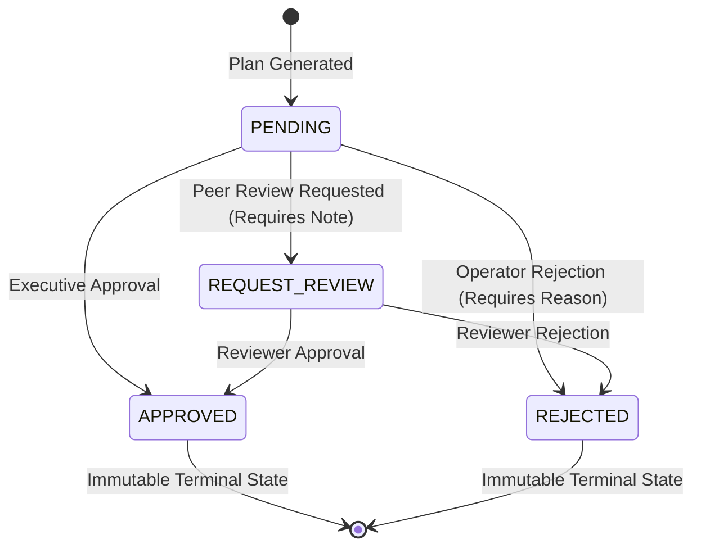

# ADR-006: Decision Governance State Machine & Immutable Audit Trail

## Status
Accepted

## Context
AI-generated optimization plans in national energy infrastructure cannot automatically trigger unilateral procurement without human oversight. Decisions require formal human-in-the-loop review, justification tracking, and strict state transition validation.

## Decision
We implemented a strict, finite-state governance machine (`apps/api/routes/decisions.py` and `db/models.py`) with an append-only audit trail:

### Governance Rules:
1. **Mandatory Justification**: Any transition to `REJECTED` or `REQUEST_REVIEW` must include a non-empty `reason` payload.
2. **Terminal States**: `APPROVED` and `REJECTED` states cannot be overridden or transitioned without generating a new scenario version.
3. **Immutable Audit Trail (`decision_audit_logs`)**:
   - Every state transition records: `decision_id`, `actor_id`, `old_status`, `new_status`, `reason`, `comment`, `action_plan_hash`, `timestamp_utc`.

## Consequences
- **Positive**: Complete compliance with enterprise energy regulatory standards; full auditability for forensic post-incident reviews.
- **Trade-offs**: Requires UI approval dialogs and reason validation modals in Decision Center.
